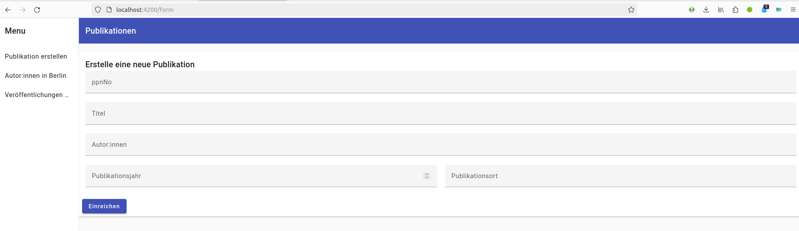

# Interview Task

## Task description

Erstellen Sie ein Angular-Projekt und richten Sie es in Ihrer bevorzugten Entwicklungsumgebung ein. Das Projekt enthält eine JSON-Datei mit Metadaten (SampleData.json) zu 60 Veröffentlichungen. Die JSON-Struktur enthält verschiedene Felder, aber für diese Aufgabe werden nur die folgenden Felder verwendet:

    ppnNo: Eindeutige Kennung der Veröffentlichung
    authorList: Liste aller Autoren der Veröffentlichung
    publication date:  Jahr der Veröffentlichung
    place: Ort der Veröffentlichung

Sie müssen Angular-Komponenten und Services erstellen, um die JSON-Daten zu lesen und die folgenden Aufgaben zu erledigen:

## Tasks

1. Lesen Sie die Datensätze aus "SampleData.json".Benutzen Sie bitte Observables. 
2. Erstellen Sie eine Nav-Bar, die die folgenden Links enthält: "Publikation erstellen", "Veröffentlichungen pro Jahr", "Autor:innen in Berlin". 
3. Unter dem Link "Publikation erstellen" sollte ein Formular angezeigt werden, das die folgenden Felder enthält: "ppnNo", "authorList", "publication date" und "place". Wenn das Formular ausgefüllt und gesendet wird, reicht eine Information wie "Danke für die Einreichung" aus. Die Daten müssen nicht gespeichert werden. 
4. Erstellen Sie unter dem Link "Autor:innen in Berlin"  eine Tabelle, die die "ppnNo" und den "Nachnamen" aller "Autor:innen" aller Veröffentlichungen auflistet, die in "Berlin" veröffentlicht wurden.
   
          #	       PPN	         Author
          1	       1008783722	   Westermark, Herzel    
          2	       100891777X	   Mahlein, Hoppe, Speck, Schlömer

5. Erstellen Sie eine Tabelle, die die Anzahl der Veröffentlichungen pro Jahr anzeigt. Sie können die Tabelle in einer separaten Komponente erstellen und in der Hauptkomponente anzeigen. Die Tabelle sollte die folgenden Spalten enthalten: "Jahr" und "Anzahl".

        Jahr	Anzahl
        2017	47
        2018	1
6. 
6. Sie können Angular Material oder andere Bibliotheken verwenden, um die Tabellen ansprechend zu gestalten. Es kommt eher auf die Funktionalität an.

Beispielsweise könnte das Formular so aussehen:
 

Extra: Achten Sie auf Barrierarmut ihrer Anwendung, verwenden Sie zB ARIA-Attribute, Focus Trap, etc .. 

Hinweis: Ihre Lösung muss eine komprimierte Kopie des Codes/Projekts enthalten.

