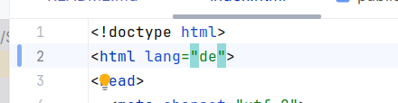
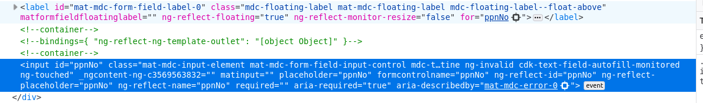
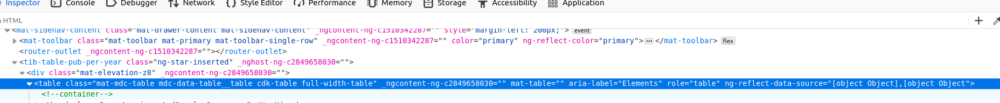

## Accessability
npm install eslint-plugin-jsx-a11y @angular-eslint/eslint-plugin --save-dev
um die Barrierefreiheit zu verbessern, wurde das Plugin eslint-plugin-jsx-a11y installiert. und eslint angeschaltet

# Sprache 
von englisch auf deutsch

# Semantik HTML
## Lables
zu den Textfeld in dem Formular, wurden Lables hinzugefügt
<mat-label>ppnNo</mat-label> -> Material Klasse die id und for verknüpft

MatFormField verbindet die Label automatisch mit dem Steuerelement des Feldes über ein natives <label>-Element und verwendet das for-Attribut, um auf die ID des Steuerelements zu verweisen.
Beim Informationstext über <mat-error> fügt MatFormField die IDs dieser Elemente automatisch dem aria-describedby-Attribut des Steuerelements hinzu. Zusätzlich setzt MatError standardmäßig aria-live="polite", sodass unterstützende Technologien Fehler ankündigen, wenn sie auftreten.
##Input
type="text" 

## Navigation
Die Elemente <mat-sidenav> und <mat-sidenav-content> werden jeweils mit einem passenden role-Attribut versehen. Das <mat-sidenav> eher ein Inhaltsverzeichnis ist, wird es mit role="directory" versehen. Das <mat-sidenav-content> wird mit role="main" versehen, da es den Hauptinhalt der Seite darstellt.
 ### Fokus
Das Sidenav hat die Fähigkeit, den Fokus zu erfassen. Dieses Verhalten ist für die Modi "push" und "over" aktiviert und für den Modus "side" deaktiviert. Sie können das Standardverhalten über das autoFocus-Input ändern.
Standardmäßig wird das erste fokussierbare Element beim Öffnen den Fokus erhalten. Wenn ein anderes Element fokussiert werden soll, können Sie das cdkFocusInitial-Attribut auf dieses setzen.

## Table 

Standardmäßig verwendet MatTable role="table"` für Tabellen, das könnte ich ändern, passt aber hier.
Material CDK (Component Dev Kit) bietet Unterstützung für Barrierefreiheit bei Tabellen. MatTable basiert auf der CDK-Datentabelle
Überschrift zu den Tabellen hinzufügen mit [Caption](https://developer.mozilla.org/en-US/docs/Learn/HTML/Tables/Advanced#adding_a_caption_to_your_table_with_caption)
<thead> element must wrap the part of the table that is the header — this is usually the first row containing the column headings, but this is not necessarily always the case. If you are using <col>/<colgroup> elements, the table header should come just below those.
The <tbody> element needs to wrap the main part of the table content that isn't the table header or footer
name + role="columnheader" für die Tabellenüberschriften
role="row" für die Tabellenzeilen
role="cell" für die Tabellenzellen
caption hinzugefügt für die Tabelle
https://html.spec.whatwg.org/multipage/tables.html#the-caption-element

# Tastaturbedienung
Skiplink
 
Fokusstate Button (Outline)
https://stackoverflow.com/questions/67364304/how-do-i-add-outline-on-focus-to-material-button 

php webtech bachlor (max baier), learn with gio (php beginner 2023), LaraCasts php basic tutorial (Larawell framework)

verwendete Quellen:
https://blog.angular.dev/improving-angular-components-accessibility-89b8ae904952
https://v5.material.angular.io

#nav - ListKeyManager

@ViewChildren(MatListItem) is used to get a list of MatListItem elements.
ListKeyManager is initialized in the ngAfterViewInit lifecycle hook to manage the list of items.
aria-current="page" -> Reihe verwandter Elemente, die den aktuellen Abschnitt einer Website darstellen.

form: aria-labelledby="formTitle" beim error die id="formTitle" hinzufügen
