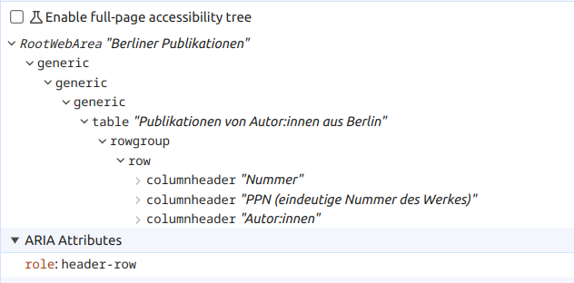
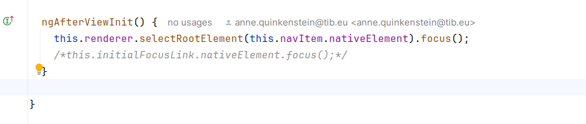
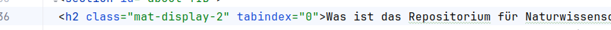
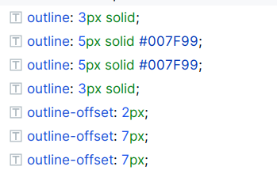
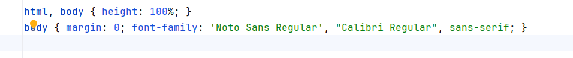
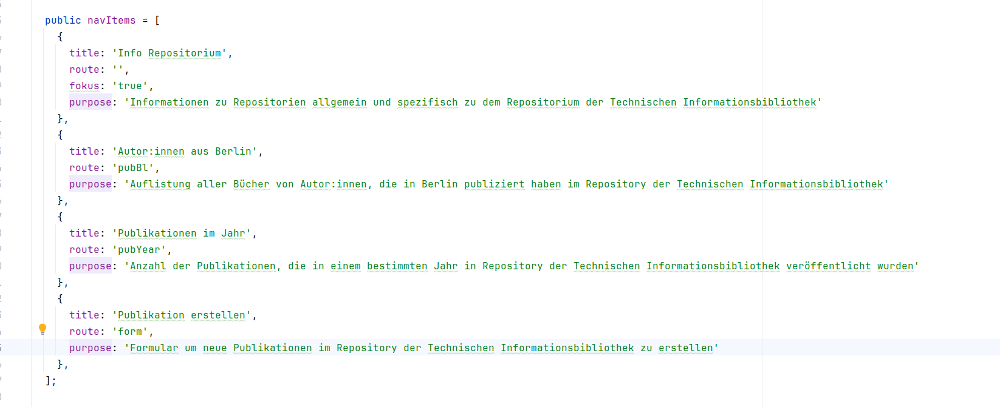

# Semantisches  Markup.

## HTML
Verwendung von `<header>`, `<nav>`, `<main>`, `<section>`,`<footer>` um die logische Struktur der Seite zu verdeutlichen.
bei `<main>` habe ich mich entschieden, dass die Informationen der Main Inhalt sind und weiteres 

## Formular
### mat-form (Material)
- `<form>`-Tag, um das gesamte Formular zu umschließen.
- `<mat-form-field>` und `<mat-label>` verknüpfen Labels korrekt mit den Eingabefeldern (for-Attribut verweist auf die ID des Steuerelements)
- `<mat-error>` um Fehlerzustände anzuzeigen. `aria-describedby`-Attribut wird automatisch hinzugefügt, um Fehlermeldungens - `ID` zu verknüpfen. Außerdem wird das Attribut `aria-live="polite"` verwendet, um sicherzustellen, dass Screenreader Benutzer über Fehler informieren, ohne ihre aktuelle Aufgabe zu stark zu unterbrechen.
- `aria-required="true"` automatisch hinzugefügt, `name`-Attribut wird automatisch hinzugefügt
- selbst hinzugefügt: `autocomplete="PPN"` um die Eingabe zu erleichtern
- `type="text"`, etc. für Eingabefelder
-> Fazit: Aufpassen, dass nicht alles mehrfach ausgezeichnet wird, da Material das bereits macht.
### einfaches Formular in Modal
- `Label - Input` Feld Kombination wird zusammengehalten von dem `for`-Attribut, das auf die ID des Inputs verweist 
- `Typ`-Attribut für Eingabefelder, um die Art der Eingabe zu spezifizieren
- `Autocomplete`-Attribut für Eingabefelder, um die Eingabe zu erleichtern

## Tabellen 
### mat-table (Material) 
- Standardmäßig verwendet MatTable `role="table"` für Tabellen, das könnte ich ändern, passt aber hier.
- `role` = "header-row", "row", ... für die entsprechenden Elemente hinzugefügt, um die Struktur der Tabelle zu verdeutlichen

- mit [`<caption>`](https://html.spec.whatwg.org/multipage/tables.html#the-caption-element)   Überschrift zum besseren Verständnis der Tabellen hinzugefügt
- im `<table>`-Tag `aria-lable="Beschreibung, was die Tabelle zeigt"` hinzugefügt, um die Tabelle zu beschreiben

## Navigation
-  `<mat-sidenav>`  habe ich die `role = "navigation"` um die Funktion zu verdeutlichen
- `<mat-sidenav-content> ` habe ich die `role = "section"`, da sie jeweils die Seite zum Link darstellt (ich hatte erst überlegt sie als "main" zu deklarieren, aber mich dann für "section" entschieden, da es sich um eine Teilseite handelt)
-  `<mat-toolbar>` bekommt `role = "banner"` zugewiesen, um die Funktion zu verdeutlichen
- Links (`<a>` - Tags) haben ein `aria-label` in dem der Zweck des Links zu verdeutlicht wird 
- der Toggle Button hat ein aria-label, um die Funktion zu verdeutlichen
- das Icon hat ein aria-label, um es und seine Funktion zu beschreiben 
-` aria-expanded="true"` oder "false" wird verwendet, um den Zustand des Menüs zu beschreiben
-` aria-disabled="false"`, um zu verdeutlichen, dass das Menü aktiv ist
- `aria-current="page"` wird verwendet, um eine Reihe verwandter Elemente, die den aktuellen Abschnitt einer Website darstellen, zu kennzeichnen.
- form: `aria-labelledby="formTitle" `beim error ->  `id="formTitle" `wird automatisch durch material hinzugefügt
-
aria-hidden="true" - zb beim skiplink - noch erklären

# Das Projekt ist über die Tastatur bedienbar.
## Menü Navigation
### automatischer Fokus auf das 1. Element
Das Sidenav hat die Fähigkeit, den Fokus zu erfassen. Standardmäßig wird das erste fokussierbare Element beim Öffnen den Fokus erhalten. Passt. 

### Möglichkeit innerhalb des Menüs zu navigieren mit Pfeiltasten 
Es soll möglich sein, ohne aus dem Menü zu fallen, mit den Pfeiltasten zu navigieren.

#### 1. Versuch ListKeyManager
- ListKeyManager ist von Angular Material zur Verwaltung der Tastaturnavigation in  Listen für Barrierefreiheit 
- sieht einfach aus und kann eins auch grob verstehen, aber ich habe es nicht geschafft, es in meinem Projekt zu implementieren
- ActiveDescendantKeyManager ist eine weitere Option, die ich ausprobiert habe, hat auch nicht geklappt

#### 2. Versuch händisch mit FocusKeyManager um die Tastaturnavigation zu steuern
- Erstellung von zwei benutzerdefinierten Direktiven (`appListItemFocusable` und `appNavListKeyManager`), die auf `mat-list-item` und `mat-nav-list` angewendet werden.
  - ##### `appListItemFocusable` Directive
  - Zweck: Stellt sicher, dass jedes Listenelement die `FocusableOption`-Schnittstelle implementiert und korrekt fokussiert werden kann.
  - Schlüsselmethoden und Eigenschaften:
    - `focused` (Subject): Benachrichtigt, wenn das Element fokussiert ist.
    - `focus()`: Fokussiert das Element.
    - Lifecycle-Hooks (`ngAfterViewInit` und `ngOnDestroy`): Initialisiert und beendet das Fokussieren des Elements.
  - ##### `appNavListKeyManager` Directive
    - Zweck: Verwaltet die Tastaturnavigation in einer Liste von Listenelementen.
    - Schlüsselmethoden und Eigenschaften:
      -  `keyManager`: Instanz von `FocusKeyManager`, der die Navigation steuert.
      - `onKeydown()`: Hört auf Tastatureingaben und wendet die Navigation an.
      - selben Lifecycle-Hooks 
  - ##### `@ViewChild` 
    - Referenz auf ein DOM-Element im Template
     zB.:  `navItem` =  `#navItem`  im Template.
    - `ElementRef` wird verwendet, um auf das native DOM-Element zuzugreifen.
  - ##### `Renderer2` 
    - um den Fokus zu steuern
    - direkte DOM-Manipulation hat nicht funktioniert, deswegen Renderer2 benutzt
    - 
  
## tabindex
- tabindex="0" wird verwendet, um ein Element in die Tab-Reihenfolge aufzunehmen
- 
- 
## Aria-Attribute verwenden
siehe oben bei Navigation

## Focus-Trap für modale Dialoge
Focus-Trap wird verwendet, um den Fokus innerhalb eines Dialogs zu halten, bis er geschlossen wird.
Hier habe ich das cdkTrapFocus aus dem A11yModule aus Angular CDK ausprobiert. Ich hab nicht `mat-form` verwendet, sondern den Rest möglichst einfach gehalten, damit die Bibliotheken sich nicht gegenseitig in die Quere kommen. 
- `cdkTrapFocus`:  Diese Direktive fängt den Fokus innerhalb des spezifizierten Elements ein, sodass Benutzer:innen den Fokus nicht aus dem Modal heraus tabben können.
- `cdkTrapFocusAutoCapture`: Dieses Eingabeattribut setzt automatisch den Fokus auf das erste fokussierbare Element innerhalb des `cdkTrapFocus` Containers, wenn dieser initialisiert wird.

## weiteres bzgl. WCAG 2.2
geprüft: 
2.1.2 No Keyboard Trap
2.1.3 All functionality of the content is operable through a keyboard interface without requiring specific timings for individual keystrokes.

# Die Sprache im Dokument ist angegeben.
Die Sprache ist auf deutsch eingestellt und wird im Head-Tag angegeben.
    
vgl. WCAG 2.2: 3.1.1 Language of Page 

# Ein Fokus-ring ist bei jedem Element sichtbar
vgl. WCAG 2.2: 2.4.7 Focus Visible
Any keyboard operable user interface has a mode of operation where the keyboard focus indicator is visible.
## Fokusstate (Outline)
 - hauptsächlich habe ich jeweils passende outline für den Fokusstate hinzugefügt 
 - 
 - dafür habe ich den Elementen eine Klasse hinzugefügt, die den Fokusstate definiert oder ich habe die Materialklassen gesucht und dort einen Fokusstate hinzugefügt
 - Formfeldern habe ich eine Linie hinzugefügt, die den Fokusstate anzeigt - da diese eh schon ziemlich voll sind 
 - nicht vergessen habe ich bei kleinen Bildschirmen erscheinende Toggle Menü

## Navigation
- bei der Navigation habe ich drauf geachtet, dass der Unterschied zwischen einem fokussierten und einem aktivem Link sichtbar ist 
- Fokus: Fokusring, aktiv: blaue Schriftfarbe

# Ein Skip-link ist Vorhanden, um Bereiche zu überspringen.   
vgl. WCAG 2.2: Skiplink. 2.4.1 Bypass Blocks
A mechanism is available to bypass blocks of content that are repeated on multiple Web pages.

1. Skip-Link hinzugefügt, um die wichtigsten Informationen für Einsteiger*innen zu erreichen
2. Skip-Link um direkt zur Hauptaufgabe, neue Publikationen hinzuzufügen, zu springen

direktive autofocus benutzt <!-- Use the fragment directive to point to the ID of the element to scroll to -->
in der app-componente, damit von überall zu benutzen ist 
da wo ich hinnavigiere: appAutoFocus type="text" id="ppnNo"  

Schriftart: https://www.leserlich.info/kapitel/zeichen/schriftart.php#schriftliste, Calibri Regular

Kontrast:
https://www.leserlich.info/werkzeuge/kontrastrechner/index.php
Der Farbcode `#009FB7` (RGB 0, 159, 183) auf Weiß (`#FFFFFF`) hat ein Kontrastverhältnis von etwa 2.71:1, was bedeutet, dass er nicht den Mindestanforderungen für Barrierefreiheit entspricht. schriftfarbe bei Fokus geändert  in #007F99 Kontrastverhältnis: 4.07:1

## 1.1 Text Alternatives (alt-Text bei Bildern und Icons)

## 1.3.4 Orientation
relativen Maßen, Flexbox Design

## 2.4.4 Link Purpose (In Context)
The purpose of each link can be determined from the link text alone or from the link text together with its programmatically determined link context, except where the purpose of the link would be ambiguous to users in general.

## 2.4.6 Headings and Labels
Headings and labels describe topic or purpose.

## 2.4.9 Link Purpose (Link Only)
A mechanism is available to allow the purpose of each link to be identified from link text alone, except where the purpose of the link would be ambiguous to users in general.

## 3.3.1 Error Identification
If an input error is automatically detected, the item that is in error is identified and the error is described to the user in text.

erwendete Quellen:
https://blog.angular.dev/improving-angular-components-accessibility-89b8ae904952
https://v5.material.angular.io
https://www.leserlich.info

## IDE
npm install eslint-plugin-jsx-a11y @angular-eslint/eslint-plugin --save-dev
um die Barrierefreiheit zu verbessern, wurde das Plugin eslint-plugin-jsx-a11y installiert. und eslint angeschaltet

